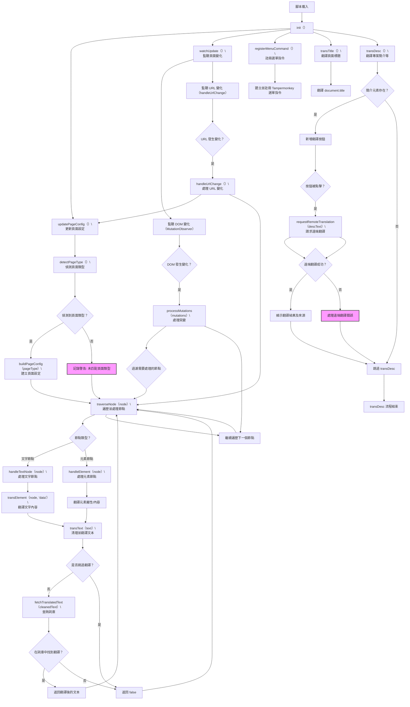

# GitHub 中文化插件腳本流程圖

以下是根據 `src/github-auto-trans-cn.js` 腳本分析得出的流程圖：

```mermaid
graph TD
    A[腳本載入] --> B[init（）]
    B --> C[updatePageConfig（）\\n初始設定]
    B --> D[watchUpdate（）\\n監聽頁面變化]
    B --> E[registerMenuCommand（）\\n註冊選單指令]
    B --> F[transTitle（）\\n翻譯頁面標題]
    B --> G[transDesc（）\\n翻譯專案簡介等]
    C --> H[detectPageType（）\\n偵測頁面類型]
    H --> I{偵測到頁面類型？}
    I -- 是 --> J[buildPageConfig（pageType）\\n建立頁面設定]
    I -- 否 --> K[記錄警告: 未匹配頁面類型]

    D --> L[監聽 DOM 變化 （MutationObserver）]
    D --> M[監聽 URL 變化 （handleUrlChange）]

    L --> N{DOM 發生變化？};
    N -- 是 --> O[processMutations（mutations）\\n處理突變];
    O --> P{過濾需要處理的節點};
    P --> Q[traverseNode（node）\\n遍歷並處理節點];

    Q --> R{節點類型？};
    R -- 文字節點 --> S[handleTextNode（node）\\n處理文字節點];
    R -- 元素節點 --> T[handleElement（node）\\n處理元素節點];

    S --> U[transElement（node, 'data'）\\n翻譯文字內容];
    T --> V[翻譯元素屬性/內容];

    U --> W[transText（text）\\n清理並翻譯文本];
    V --> W;

    W --> X{是否跳過翻譯？};
    X -- 否 --> Y[fetchTranslatedText（cleanedText）\\n查詢詞庫];
    X -- 是 --> Z[返回 false];

    Y --> AA{在詞庫中找到翻譯？};
    AA -- 是 --> AB[返回翻譯後的文本];
    AA -- 否 --> Z;

    M --> AC{URL 發生變化？};
    AC -- 是 --> AD[handleUrlChange（）\\n處理 URL 變化];
    AD --> C[updatePageConfig（）\\n更新頁面設定];

    E --> AE[建立並註冊 Tampermonkey 選單指令];

    F --> AF[翻譯 document.title];

    G --> AG{簡介元素存在？};
    AG -- 是 --> AH[新增翻譯按鈕];
    AH --> AI{按鈕被點擊？};
    AI -- 是 --> AJ[requestRemoteTranslation（descText）\\n請求遠端翻譯];
    AJ --> AK{遠端翻譯成功？};
    AK -- 是 --> AL[顯示翻譯結果及來源];
    AK -- 否 --> AM[處理遠端翻譯錯誤];
    AG -- 否 --> AN[跳過 transDesc];

    %% buildPageConfig 更新 pageConfig，供 traverseNode 使用
    AJ --> AK;
    J --> Q;
    %% 警告不停止遍歷，但設定可能不完整
    K --> Q;

    %% 翻譯後的文本用於更新節點，是遍歷過程的一部分
    AB --> Q;
    %% 沒有翻譯，繼續遍歷
    Z --> Q;

    %% 顯示後，按鈕點擊流程結束
    AL --> AN;
    %% 處理錯誤後，按鈕點擊流程結束
    AM --> AN;

    AN --> AO[transDesc 流程結束];

    %% 循環遍歷
    Q --> AP[繼續遍歷下一個節點];
    AP --> Q;

    %% 處理完所有突變後，繼續監聽
    O --> AP;

    %% URL 變化更新設定後，重新處理 DOM (透過 observer 或顯式掃描)\\n程式碼顯示 MutationObserver 會在設定更新後處理
    AD --> Q;
    style K fill:#f9f,stroke:#333,stroke-width:2px
    style AM fill:#f9f,stroke:#333,stroke-width:2px
```
