```mermaid
flowchart TD
    Start([開始<br/>初始化腳本])

    %% ====== INIT ======
    Start --> Init[init<br/>（初始化翻譯功能）]
    Init --> SetLang[設定<br/>document.documentElement.lang<br/>＝ CONFIG.LANG]
    SetLang --> MO_Lang[MutationObserver<br/>監控 lang 屬性]
    MO_Lang --> TurboEvt[turbo:load<br/>事件監聽]
    TurboEvt --> MenuReg[registerMenuCommand<br/>註冊功能選單]
    MenuReg --> WatchUpd[watchUpdate<br/>監控 DOM 變動]
    WatchUpd --> DOMContent[DOMContentLoaded<br/>頁面初始翻譯]
    DOMContent --> UpdatePC[updatePageConfig<br/>（'首次載入'）]
    UpdatePC --> buildPC[buildPageConfig<br/>產生 pageConfig]
    buildPC --> Traverse[traverseNode<br/>遍歷 body 執行翻譯]

    %% ====== watchUpdate ======
    WatchUpd --> MOStart[監控 document.body<br/>MutationObserver]
    MOStart --> DIAMOND_URL{<br/>currentURL ＝＝ previousURL<br/>？}
    DIAMOND_URL -- 否 --> UpdatePC2[updatePageConfig<br/>（'DOM變化'）]
    UpdatePC2 --> buildPC2
    DIAMOND_URL -- 是 --> ContMut[遍歷突變]
    UpdatePC2 --> ContMut

    %% ====== processMutations 分支 ======
    ContMut --> DIAMOND_MUT{<br/>type ＝＝ 'childList' 且<br/>addedNodes.length ＞ ０？}
    DIAMOND_MUT -- 是 --> AddNodes[取出<br/>...addedNodes]
    DIAMOND_MUT -- 否 --> AttrText[type ＝＝ 'attributes'<br/>或 'characterData' 且<br/>頁型允許？]
    AttrText --> 是 --> TargetNode[處理 target]
    AttrText --> 否 --> SkipNode[跳過]
    AddNodes --> FilterNodes
    TargetNode --> FilterNodes
    SkipNode --> MOStart

    FilterNodes[過濾<br/>父元素是否在<br/>ignoreMutationSelectors]
    FilterNodes --> 否 --> TraverseNodes[traverseNode<br/>遞迴處理每個節點]
    FilterNodes --> 是 --> MOStart

    %% ====== traverseNode 遞迴 ======
    TraverseNodes --> DIAMOND_TEXT{<br/>nodeType ＝＝ TEXT_NODE？}
    DIAMOND_TEXT -- 是 --> HandleText[handleTextNode]
    DIAMOND_TEXT -- 否 --> TreeWalker[TreeWalker 遍歷<br/>ELEMENT_NODE 及 TEXT_NODE]

    HandleText --> DIAMOND_LEN{<br/>node.length ＞ 500？}
    DIAMOND_LEN -- 是 --> EndTraverse[跳過此節點]
    DIAMOND_LEN -- 否 --> TransElemData[transElement<br/>node, 'data']
    TransElemData --> EndTraverse
    EndTraverse --> TreeWalker

    TreeWalker --> HandleElem[處理不同標籤屬性]
    HandleElem --> TransTime[transTimeElement]
    HandleElem --> TransInp[按型態翻譯 value/placeholder]
    HandleElem --> TransOpt[transElement<br/>node, 'label']
    HandleElem --> TransBtn[翻譯 title、data-confirm 等]
    HandleElem --> TransAria[transElement<br/>node, 'ariaLabel']
    TransTime & TransInp & TransOpt & TransBtn & TransAria --> EndTreeWalker[完成單一節點]
    EndTreeWalker --> TreeWalker

    %% ====== transElement/ transText 流程 ======
    TransElemData --> DIAMOND_TXT{<br/>text 是否存在？}
    DIAMOND_TXT -- 否 --> EndTraverse
    DIAMOND_TXT -- 是 --> TransText[transText（text）]

    TransText --> DIAMOND_SKIP{<br/>shouldSkip（text）？}
    DIAMOND_SKIP -- 是 --> EndTraverse
    DIAMOND_SKIP -- 否 --> CleanText[清理與 trim]
    CleanText --> FetchTrans[fetchTranslatedText]
    FetchTrans --> DIAMOND_RET{<br/>translatedText !== cleanedText？}
    DIAMOND_RET -- 是 --> ReplaceText[回傳替換後字串]
    DIAMOND_RET -- 否 --> EndTraverse

    %% ====== fetchTranslatedText 判斷 ======
    FetchTrans --> DIAMOND_DICT{<br/>有靜態翻譯？}
    DIAMOND_DICT -- 是 --> ReturnDict[回傳翻譯]
    DIAMOND_DICT -- 否 --> DIAMOND_REG{<br/>FeatureSet.enable_RegExp？}
    DIAMOND_REG -- 是 --> ForReg[遍歷 regexpRules]
    ForReg --> DIAMOND_MATCH{<br/>translatedText !== text？}
    DIAMOND_MATCH -- 是 --> ReturnReg[回傳正則翻譯]
    DIAMOND_MATCH -- 否 --> ReturnFalse[回傳 false]
    DIAMOND_REG -- 否 --> ReturnFalse
    ReturnDict & ReturnReg & ReturnFalse --> FetchTrans

    %% ====== transDesc（翻譯按鈕）流程 ======
    TurboEvt --> DIAMOND_DESC{<br/>有描述選擇器？}
    DIAMOND_DESC -- 否 --> EndTurbo[跳過]
    DIAMOND_DESC -- 是 --> DescBtn[插入翻譯按鈕]
    DescBtn --> DIAMOND_BTN{<br/>button.disabled？}
    DIAMOND_BTN -- 否 --> GetText[取出描述文字]
    GetText --> DIAMOND_VAL{<br/>descText 是否存在？}
    DIAMOND_VAL -- 否 --> EndTurbo
    DIAMOND_VAL -- 是 --> ReqRemote[requestRemoteTranslation]
    ReqRemote --> ShowTrans[顯示翻譯結果]
    ShowTrans --> EndTurbo
    DIAMOND_BTN -- 是 --> EndTurbo

    %% ====== registerMenuCommand（選單）流程 ======
    MenuReg --> ForMenu[遍歷功能選單]
    ForMenu --> DIAMOND_MENU{<br/>是否點擊？}
    DIAMOND_MENU -- 否 --> ForMenu
    DIAMOND_MENU -- 是 --> ToggleState[切換啟用/停用狀態]
    ToggleState --> DIAMOND_CB{<br/>有 callback？}
    DIAMOND_CB -- 是 --> RunCB[執行 callback]
    RunCB --> ForMenu
    DIAMOND_CB -- 否 --> ForMenu

    %% ====== detectPageType 流程 ======
    UpdatePC --> DetectPT[detectPageType]
    DetectPT --> DIAMOND_PTYPE{<br/>有詞庫且 pageType？}
    DIAMOND_PTYPE -- 否 --> LogWarn[輸出警告<br/>return false]
    DIAMOND_PTYPE -- 是 --> ReturnType[回傳 pageType]
    LogWarn & ReturnType --> buildPC

    %% ====== 結束節點 ======
    EndTurbo([結束])
```

**腳本邏輯分析：**  
- 主要流程包含：初始化(init)、監控變動(watchUpdate)、遍歷節點(traverseNode)、翻譯(transElement/transText)、描述翻譯按鈕(transDesc)、選單切換(registerMenuCommand)、頁型判斷(detectPageType)等。

> **此流程圖可直接貼入支援 Mermaid 的 Markdown 編輯器檢視。**